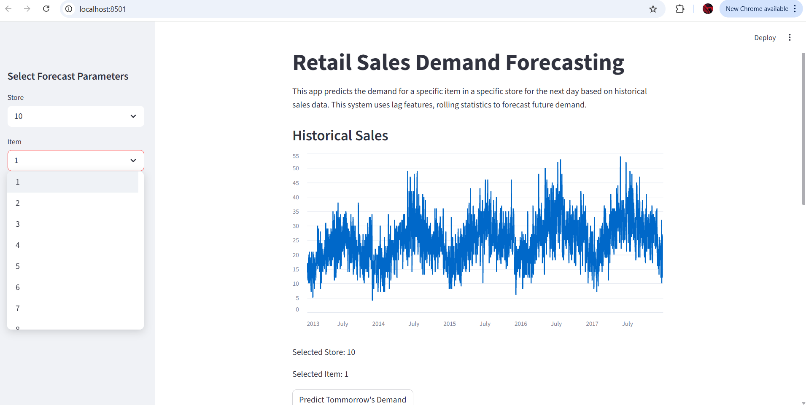
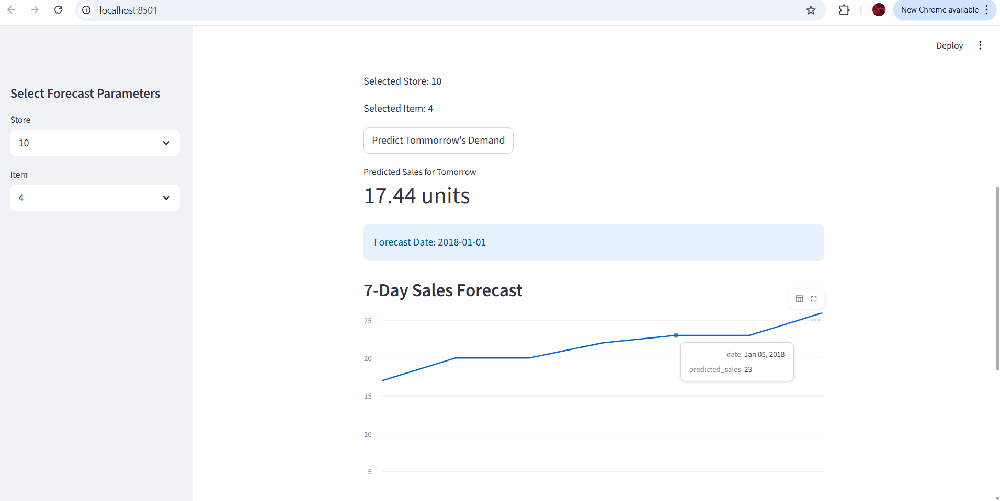
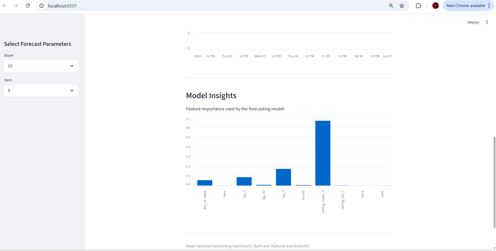

# Retail Demand Forecasting System

An **end-to-end Machine Learning project** for forecasting retail product demand using historical sales data.  
The project builds a **global demand forecasting model using XGBoost** and deploys it through an **interactive Streamlit dashboard**.

The goal is to predict future demand for **store–item combinations**, enabling better inventory planning and reducing stockouts or overstocking.

---

# Table of Contents

- Project Overview
- Problem Statement
- Dataset Description
- Exploratory Data Analysis
- Feature Engineering
- Models Experimented
- Final Model
- Model Performance
- System Architecture
- Dashboard
- Project Structure
- Installation
- How to Run the Project
- Future Improvements
- Technologies Used
- Author

---

# Project Overview

Demand forecasting is critical for retail operations. Accurate predictions help businesses:

- Optimize inventory levels
- Reduce storage costs
- Prevent stockouts
- Improve supply chain efficiency

This project develops a **machine learning pipeline** capable of forecasting demand using historical sales patterns.

The system includes:

- Data preprocessing pipeline
- Time-series feature engineering
- Model training and evaluation
- Forecasting engine
- Interactive Streamlit dashboard

---

# Problem Statement

Retail companies must determine:

> **How many units of a product should be stocked for future days?**

Poor demand forecasts can lead to:

| Issue | Impact |
|------|------|
| Stockouts | Lost sales and customer dissatisfaction |
| Overstocking | Increased inventory holding costs |
| Demand uncertainty | Inefficient supply chain operations |

The goal of this project is to build a **machine learning model that predicts daily product demand** based on historical sales data.

---

# Dataset Description

The dataset contains historical retail sales data.

### Dataset Characteristics

- 10 Stores
- 50 Products
- 5 Years of Daily Sales
- ~913,000 Observations

### Dataset Columns

| Column | Description |
|------|-------------|
| date | Date of sale |
| store | Store identifier |
| item | Product identifier |
| sales | Units sold |

---

# Exploratory Data Analysis

Initial analysis was performed to understand demand patterns.

Key insights discovered:

- Strong **weekly seasonality**
- Sales follow **repeating weekly patterns**
- Demand differs across stores and items
- Overall demand trend increases gradually over time

Example visualization:

---

# Feature Engineering

Time-series models require converting sequential data into supervised learning features.

The following features were engineered.

---

## Lag Features

Lag features represent historical demand values.

Meaning:

| Feature | Meaning |
|------|------|
| lag_1 | Sales yesterday |
| lag_7 | Sales one week ago |
| lag_30 | Sales one month ago |

These capture **short-term demand momentum and weekly patterns**.

---

## Rolling Features

Rolling statistics capture recent demand trends.

| Feature | Meaning |
|------|------|
| rolling_mean_7 | Average sales in last 7 days |
| rolling_std_7 | Sales variability in last 7 days |

These features help the model understand **recent demand behavior**.

---

## Seasonal Features

Seasonal patterns were captured using date features.

These allow the model to learn **calendar-based demand patterns**.

---

# Models Experimented

Several machine learning models were trained and compared.

### 1. Linear Regression

Baseline model.

Limitations:

- Unable to capture nonlinear demand patterns
- Poor performance on complex retail demand

---

### 2. Decision Tree Regressor

Advantages:

- Captures nonlinear relationships
- Interpretable model

Limitations:

- High variance
- Overfitting on training data

---

### 3. Random Forest Regressor

Advantages:

- Reduces variance using ensemble learning
- More stable predictions

Results improved compared to decision trees.

---

### 4. XGBoost Regressor (Final Model)

Chosen as the final model due to:

- Strong performance on tabular data
- Ability to capture nonlinear interactions
- Gradient boosting improves prediction accuracy

---

# Final Model

Final model used: **XGBoost Regressor**
- Training configuration:

---

# Installation

Clone the repository:

Install dependencies:

---

# Train the Model

Run the training pipeline:

This will:

- preprocess the dataset
- generate time-series features
- train the XGBoost model
- save the trained model in `models/`

---

# Run the Dashboard

## Dashboard Overview:
Launch the Streamlit application:

## Prediction Output:

## Model Insights:

---

# Technologies Used

- Python
- Pandas
- NumPy
- Scikit-learn
- XGBoost
- Streamlit
- Matplotlib

---

# Future Improvements

Possible extensions:

- Multi-horizon demand forecasting
- Integration of external features (weather, promotions)
- Inventory optimization models
- Automated retraining pipeline
- REST API deployment
- Cloud deployment (AWS / GCP)

---

# Author

Machine Learning project focused on **time-series forecasting and ML system design**.
